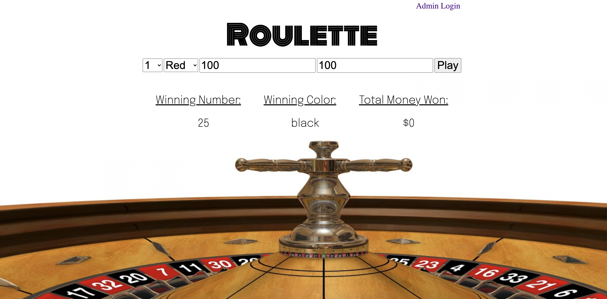

# Roulette

## Goal:

A simple roulette game that allows the user to choose their lucky number and/or color. The user can also bet any amount. The casino owner can log in and see the total wins/losses as well as see how much money has been made/lost.

## Username: admin@roulette.com
## Password: admin

## How It's Made:

**Tech Used**: HTML5, CSS3, APIs, Javascript, Node.js, MongoDB, Express framework

## Installation

1. Clone repo
2. run `npm install`

## Usage

1. run `node server.js`
2. Navigate to `localhost:8080`

## Credit

Modified from Scotch.io's auth tutorial
